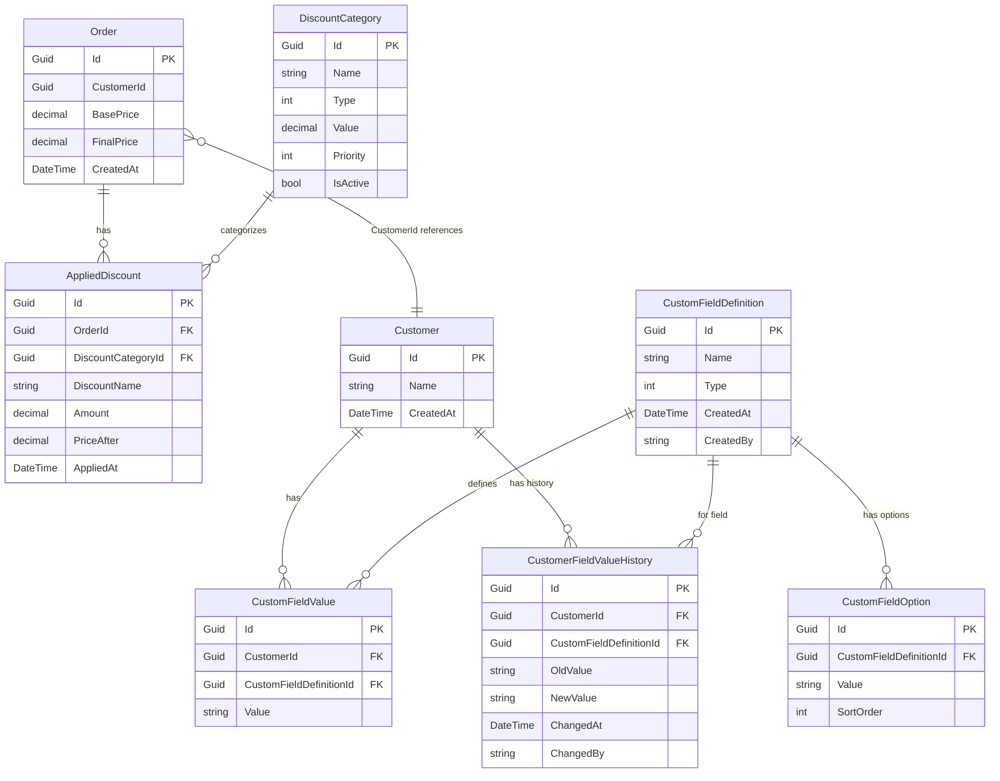

# OMS – Entity-Relationship Model

This document describes the relationships between the objects (entities) in the OMS database.

---

## Diagram (Mermaid)

---

## Entity summary

| Entity | Table | Description |
|--------|--------|-------------|
| **Order** | `Orders` | Order header; has `CustomerId` (references Customer). |
| **AppliedDiscount** | `AppliedDiscounts` | One discount applied to an order; links Order and DiscountCategory. |
| **DiscountCategory** | `DiscountCategories` | Definition of a discount type (e.g. PriceList, Promotion, Coupon). |
| **Customer** | `Customers` | Customer master; can have custom field values and history. |
| **CustomFieldDefinition** | `CustomFieldDefinitions` | Definition of a custom field (Text or Dropdown); global for all customers. |
| **CustomFieldOption** | `CustomFieldOptions` | One option for a Dropdown custom field. |
| **CustomFieldValue** | `CustomerCustomFieldValues` | One value per customer per custom field (unique on CustomerId + CustomFieldDefinitionId). |
| **CustomerFieldValueHistory** | `CustomerFieldValueHistory` | One row per change: old value → new value + timestamp (and optional ChangedBy). |

---

## Relationships (cardinality)

| From | To | Cardinality | FK | Notes |
|------|-----|-------------|-----|-------|
| Order | AppliedDiscount | 1 : N | OrderId | Cascade delete. |
| DiscountCategory | AppliedDiscount | 1 : N | DiscountCategoryId | Restrict delete. |
| Order | Customer | N : 1 | CustomerId | Logical reference (no EF FK from Order to Customer). |
| Customer | CustomFieldValue | 1 : N | CustomerId | Cascade delete. |
| CustomFieldDefinition | CustomFieldValue | 1 : N | CustomFieldDefinitionId | Restrict delete. |
| CustomFieldDefinition | CustomFieldOption | 1 : N | CustomFieldDefinitionId | Cascade delete. |
| Customer | CustomerFieldValueHistory | 1 : N | CustomerId | Cascade delete. |
| CustomFieldDefinition | CustomerFieldValueHistory | 1 : N | CustomFieldDefinitionId | Restrict delete. |

---

## Constraints

- **CustomFieldValue**: unique index on `(CustomerId, CustomFieldDefinitionId)` — at most one value per customer per field.
- **DiscountCategory.Type**: 0 = Percentage, 1 = Fixed (enum).
- **CustomFieldDefinition.Type**: 0 = Text, 1 = Dropdown (enum).
